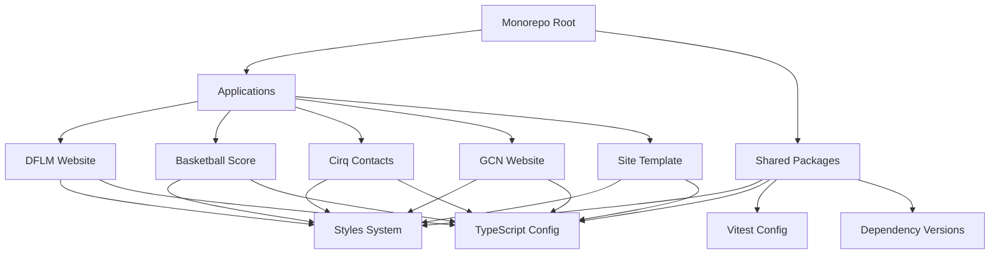

# 项目概览

Monorepo 包含多个相互关联的前端项目，每个项目都有其特定的用途和目标用户。本页面提供所有项目的概览和快速访问。

## 应用项目

### 🌟 DFLM 网站

> 企业官网 | Vue 3 + Tailwind CSS

**项目描述**: 大蒜食品公司的官方网站，展示产品信息和公司介绍。

**技术栈**: Vue 3, Vue Router, Tailwind CSS, Vite

**特色功能**:

- 响应式设计，支持移动端和桌面端
- 产品展示和公司介绍
- 现代化的 UI 设计
- SEO 优化

**访问地址**: [开发环境](http://localhost:5173) | [生产环境](https://dflm.vercel.app)

[查看详细文档 →](/projects/dflm)

---

### 🏀 篮球计分器

> 体育应用 | Vue 3 + Pinia + Supabase

**项目描述**: 实时篮球比赛计分应用，支持球员统计和数据分析。

**技术栈**: Vue 3, Pinia, Supabase, Tailwind CSS, Vite

**特色功能**:

- 实时比分更新
- 球员统计追踪
- 比赛历史记录
- 数据可视化
- 云端数据同步

**访问地址**: [开发环境](http://localhost:5174) | [生产环境](https://basketball-score.vercel.app)

[查看详细文档 →](/projects/basketball-score)

---

### 📞 Cirq 联系人管理

> 管理工具 | Vue 3 + Supabase

**项目描述**: 现代化的联系人管理系统，支持增删改查和数据同步。

**技术栈**: Vue 3, Pinia, Supabase, Tailwind CSS, Vite

**特色功能**:

- 联系人增删改查
- 搜索和筛选
- 数据导入导出
- 云端同步
- 响应式界面

**访问地址**: [开发环境](http://localhost:5175) | [生产环境](https://cirq.vercel.app)

[查看详细文档 →](/projects/cirq)

---

### 🏢 GCN 网站

> 企业网站 | TypeScript + Naive UI

**项目描述**: 企业级网站项目，使用 TypeScript 和 Naive UI 构建。

**技术栈**: Vue 3, TypeScript, Naive UI, SCSS, Vite

**特色功能**:

- TypeScript 类型安全
- 企业级 UI 组件
- 多页面应用
- 联系表单
- 博客系统

**访问地址**: [开发环境](http://localhost:5176) | [生产环境](https://gcn-website.vercel.app)

[查看详细文档 →](/projects/gcn-website)

---

### 🎨 网站模板

> 开发模板 | Vue 3 基础模板

**项目描述**: 通用网站模板，可作为新项目的起点。

**技术栈**: Vue 3, Vue Router, Pinia, Tailwind CSS, Vite

**特色功能**:

- 最小化配置
- 标准项目结构
- 基础组件库
- 开发工具集成

**访问地址**: [开发环境](http://localhost:5177)

[查看详细文档 →](/projects/site-template)

## 共享包

### 🎨 样式系统 (@monorepo/styles)

> 统一的样式解决方案

提供统一的 CSS Reset、主题系统和组件样式。

**包含内容**:

- CSS Reset 和基础样式
- 主题变量和色彩系统
- 通用组件样式
- 工具类和辅助函数

[查看详细文档 →](/projects/styles)

---

### 📝 TypeScript 配置 (@monorepo/typescript-config)

> 统一的 TypeScript 配置

为不同类型的项目提供标准化的 TypeScript 配置。

**配置类型**:

- Vue 项目配置
- Node.js 项目配置
- 基础配置
- 严格模式配置

[查看详细文档 →](/projects/typescript-config)

---

### 🧪 Vitest 配置 (@monorepo/vitest-config)

> 统一的测试配置

提供标准化的测试配置和工具。

**功能特性**:

- 单元测试配置
- 覆盖率报告
- Vue 组件测试
- Mock 工具

[查看详细文档 →](/projects/vitest-config)

---

### 📦 依赖版本管理 (@monorepo/dependency-versions)

> 统一的依赖管理

集中管理所有项目的依赖版本，确保一致性。

**管理内容**:

- 核心框架版本
- 开发工具版本
- 项目特定依赖
- 版本获取工具

[查看详细文档 →](/projects/dependency-versions)

## 项目统计

<div class="stats-container">
  <div class="stats-grid">
    <div class="stat-item">
      <div class="stat-number">5</div>
      <div class="stat-label">应用项目</div>
    </div>
    <div class="stat-item">
      <div class="stat-number">4</div>
      <div class="stat-label">共享包</div>
    </div>
    <div class="stat-item">
      <div class="stat-number">15+</div>
      <div class="stat-label">核心依赖</div>
    </div>
    <div class="stat-item">
      <div class="stat-number">90%+</div>
      <div class="stat-label">测试覆盖率</div>
    </div>
  </div>
</div>

## 技术栈对比

| 项目       | 框架  | 状态管理 | UI 库    | 数据库   | 部署   |
| ---------- | ----- | -------- | -------- | -------- | ------ |
| DFLM       | Vue 3 | -        | Tailwind | -        | Vercel |
| 篮球计分器 | Vue 3 | Pinia    | Tailwind | Supabase | Vercel |
| Cirq       | Vue 3 | Pinia    | Tailwind | Supabase | Vercel |
| GCN 网站   | Vue 3 | -        | Naive UI | -        | Vercel |
| 网站模板   | Vue 3 | Pinia    | Tailwind | -        | -      |

## 开发状态

| 项目        | 状态      | 版本   | 最后更新 |
| ----------- | --------- | ------ | -------- |
| DFLM 网站   | ✅ 已完成 | v1.0.0 | 2024-01  |
| 篮球计分器  | ✅ 已完成 | v1.0.0 | 2024-01  |
| Cirq 联系人 | ✅ 已完成 | v1.0.0 | 2024-01  |
| GCN 网站    | ✅ 已完成 | v1.0.0 | 2024-01  |
| 网站模板    | ✅ 已完成 | v1.0.0 | 2024-01  |

## 快速开始

### 启动所有项目

```bash
# 安装依赖
pnpm install

# 启动所有开发服务器
pnpm dev
```

### 启动特定项目

```bash
# DFLM 网站
pnpm --filter dflm-website dev

# 篮球计分器
pnpm --filter basketball-score dev

# Cirq 联系人
pnpm --filter cirq dev

# GCN 网站
pnpm --filter gcn-website dev

# 网站模板
pnpm --filter site-template dev
```

### 构建所有项目

```bash
# 并行构建所有项目
pnpm build

# 构建特定项目
pnpm --filter dflm-website build
```

## 项目架构



## 下一步

- [查看具体项目文档](/projects/dflm) - 深入了解各个项目
- [学习开发指南](/guide/development) - 了解开发流程
- [探索 API 文档](/api/) - 查看共享包的 API
- [阅读最佳实践](/best-practices/) - 提高开发效率

<style>
.stats-container {
  margin: 2rem 0;
}

.stats-grid {
  display: grid;
  grid-template-columns: repeat(auto-fit, minmax(150px, 1fr));
  gap: 1rem;
}

.stat-item {
  text-align: center;
  padding: 1.5rem;
  border: 1px solid var(--vp-c-border);
  border-radius: 8px;
  background: var(--vp-c-bg-soft);
}

.stat-number {
  font-size: 2rem;
  font-weight: bold;
  color: var(--vp-c-brand-1);
  margin-bottom: 0.5rem;
}

.stat-label {
  color: var(--vp-c-text-2);
  font-size: 0.9rem;
}
</style>
